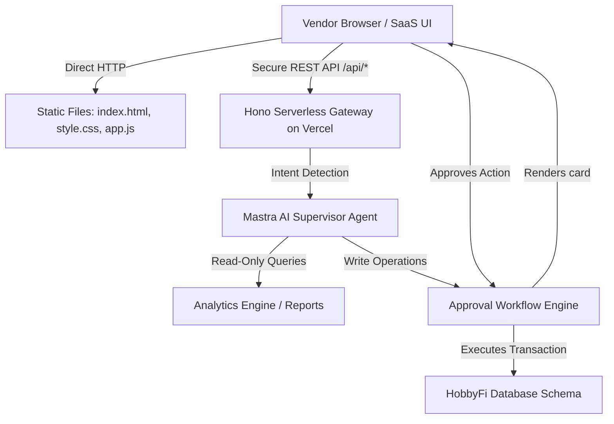

# HobbyFi Copilot — Production-Grade AI CRM System

Welcome to the official repository of **HobbyFi Copilot**, a next-generation AI CRM companion designed for the HobbyFi Vendor Portal. 

Designed and engineered by **Vaibhav Sonava (Principal AI Engineer)**, this project demonstrates a modern, secure, and blazing-fast AI execution system tailored for managing sports venues, court bookings, memberships, and financial operations.

---

### 🌐 Live Production Demo
👉 **[HobbyFi Copilot Live Dashboard](https://hobbyfi-copilot-alpha.vercel.app)**  
*Deployed globally on Vercel with serverless functions and instant cold starts.*

---

## 🏗 System Architecture

The system is built on a modular, multi-tier architecture to separate static UI serving from critical transactional AI processing:



### 1. Unified Hono Gateways
We host the backend on a single Hono-based router running on Vercel's Serverless Edge. This provides:
- **Instant Cold Starts**: Zero-dependency API execution.
- **Global Low Latency**: Handled directly by Vercel edge routes.
- **In-Memory Rate Limiting**: Ensures DDoS protection and safety.

### 2. Secure Write-Action Approval Pipeline
Any write operations (e.g. creating coupons, canceling memberships, changing attendance records) initiated by the AI **never auto-execute**. Instead:
1. The AI generates a structured `ApprovalPayload`.
2. The UI intercepts the payload and renders a custom interactive **Transaction Approval Card**.
3. The transaction is only written to the database when the vendor explicitly clicks **"Approve"**.

---

## 🛠 Technology Stack

- **Frontend**: Clean SaaS Interface, custom curated HSL color palette, typography from Google Fonts (Inter), dynamic animations, and responsive layouts. Built entirely in Vanilla HTML5/CSS3/JS to ensure zero runtime overhead.
- **Backend API**: [Hono](https://hono.dev/) serverless router for ultra-lightweight Node.js routing.
- **AI Agent Orchestration**: Inspired by the [Mastra AI Framework](https://mastra.dev/) (Supervisor-subagent design).
- **Hosting & Infrastructure**: Deployed globally on [Vercel](https://vercel.com/) with native asset pipelines and Serverless edge functions.

---

## 📊 Core Features

1. **Analytical Insights**: Chat with the Copilot to analyze court utilization, coach performances, busy hours, and weekly revenues.
2. **Interactive Charting**: Dashboard renders real-time utilization graphs using Chart.js.
3. **Adaptive UI Cards**: Rich markdown formatting (tables, bold, headers) renders automatically inside the AI chat panel.
4. **Mock Database Operations**: Full support for read-write operations mimicking CRM data.

---

## 🏃‍♂️ How to Run Locally

### 1. Install Dependencies
```bash
npm install
```

### 2. Start the Developer Server
```bash
npm run dev
```
*The local Hono server will boot on port `3015` and serve the dashboard locally.*

### 3. Open the App
Go to **`http://localhost:3015`** in your browser.

---

## 📖 Extended Engineering Documents
Detailed specifications prepared during design phases:
- [System Architecture Document](file:///docs/ARCHITECTURE.md) (Deep dive into orchestration, schemas, and pipelines)
- [System Appendix](file:///docs/APPENDIX.md) (Full details of REST APIs, schemas, and security checklists)

---
*Created with dedication and precision by Vaibhav Sonava | July 2026*
