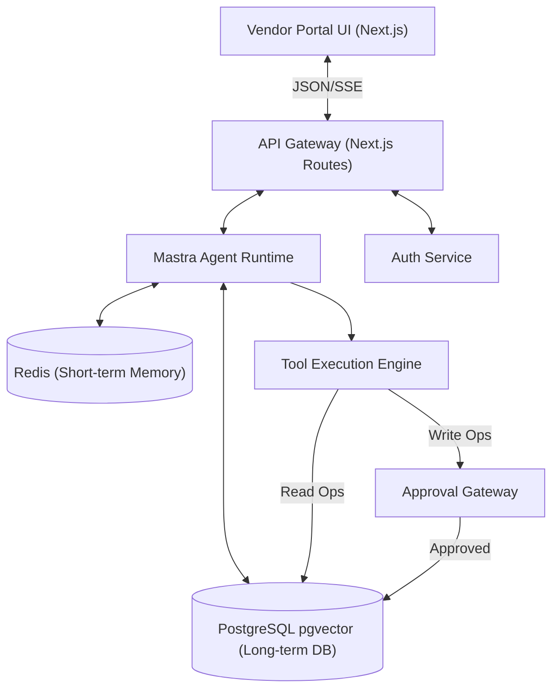
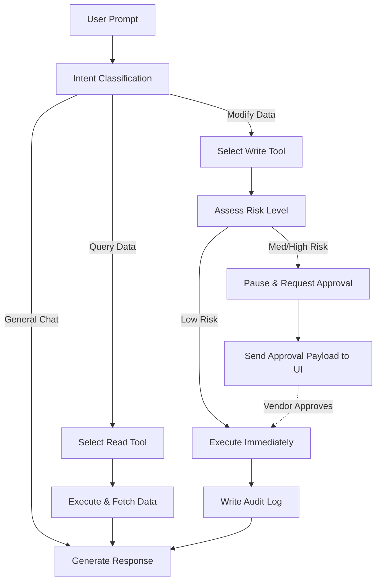
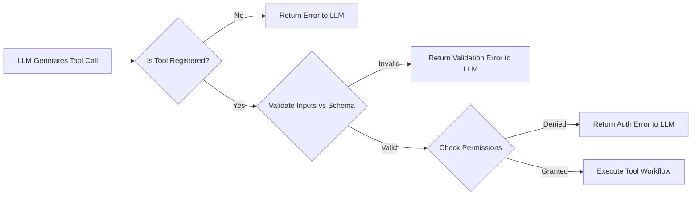
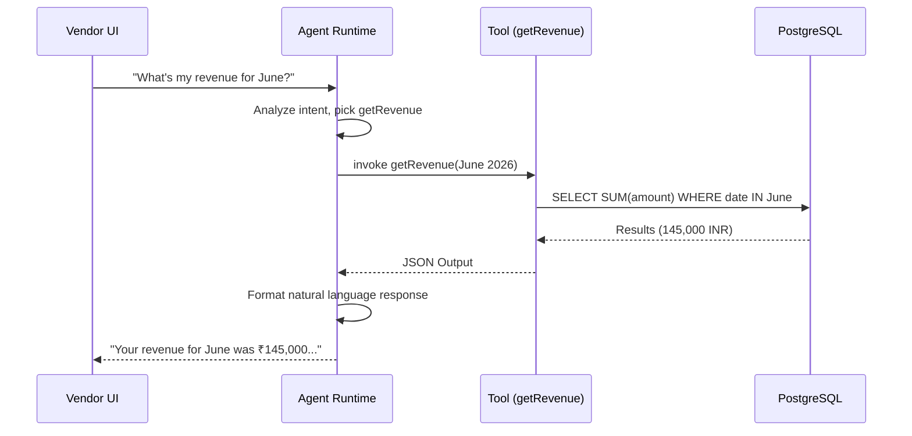
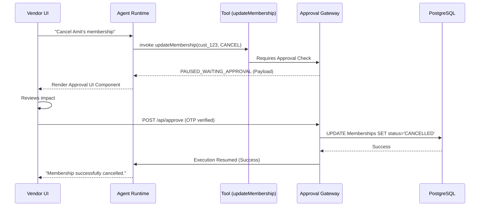
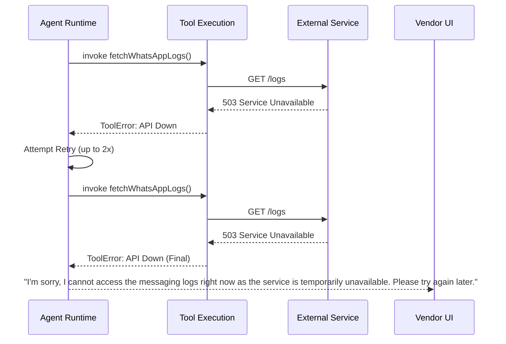
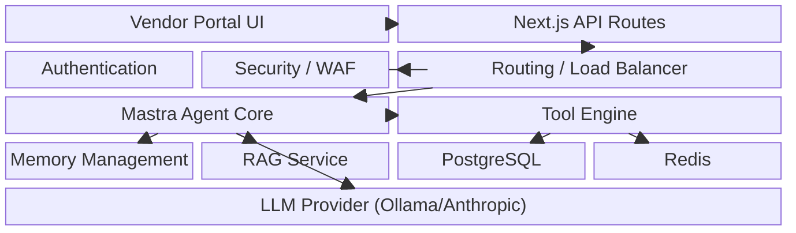
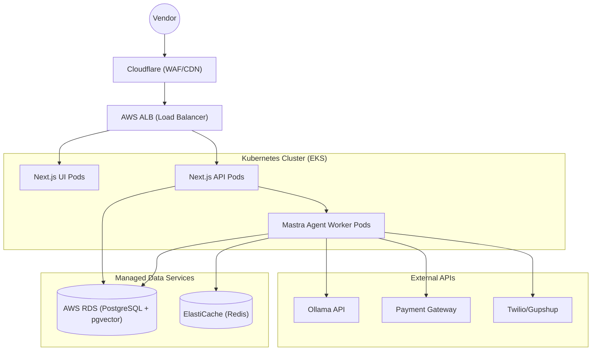
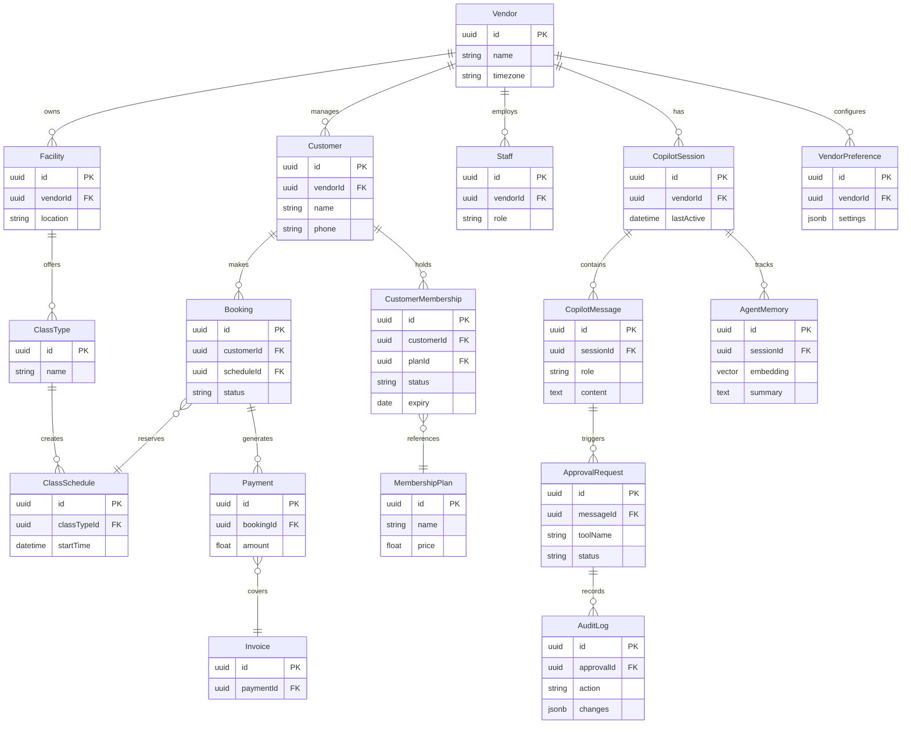

# APPENDIX: HobbyFi Copilot Reference & Artifacts

**Author:** Vaibhav Sonava - Principal AI Engineer
**Date:** July 2026

## CONTEXT
HobbyFi Copilot is an AI assistant built inside the Vendor Portal of HobbyFi (Indian sports/fitness/hobby platform). Uses Mastra AI framework, Next.js, PostgreSQL, Redis, TypeScript.

---

## 1. Folder Structure
Complete project folder structure detailing the Next.js frontend, Mastra AI framework integration, and backend services.

```text
hobbyfi-copilot/
├── src/
│   ├── app/                    # Next.js App Router (Vendor Portal UI)
│   │   ├── (dashboard)/
│   │   ├── api/                # API Routes (Next.js)
│   │   └── layout.tsx
│   ├── mastra/                 # Mastra AI Framework Core
│   │   ├── agents/             # Agent definitions & configurations
│   │   │   ├── vendorAgent.ts
│   │   │   └── index.ts
│   │   ├── tools/              # Tool definitions (Read/Write)
│   │   │   ├── read/
│   │   │   │   ├── getRevenue.ts
│   │   │   │   └── getAttendance.ts
│   │   │   ├── write/
│   │   │   │   ├── updateMembership.ts
│   │   │   │   └── cancelBooking.ts
│   │   │   └── index.ts
│   │   ├── workflows/          # Multi-step complex execution graphs
│   │   │   └── endOfDayReconciliation.ts
│   │   ├── memory/             # Short-term and Long-term context handlers
│   │   │   ├── redisMemory.ts
│   │   │   └── pgVectorSync.ts
│   │   └── guardrails/         # Safety and execution policies
│   │       ├── piiFilter.ts
│   │       └── destructiveActionLock.ts
│   ├── db/                     # Database schemas and clients
│   │   ├── schema.ts           # Drizzle/Prisma schema
│   │   ├── migrate.ts
│   │   └── index.ts
│   ├── lib/                    # Shared utilities
│   │   ├── auth.ts
│   │   ├── redis.ts
│   │   └── logger.ts
│   ├── types/                  # Global TypeScript definitions
│   │   ├── index.ts
│   │   └── tools.d.ts
│   └── config/                 # Environment and app configs
│       ├── env.ts
│       └── constants.ts
├── docs/                       # Architecture & API Documentation
│   ├── ARCHITECTURE.md
│   └── APPENDIX.md
├── tests/                      # Testing suites
│   ├── e2e/
│   ├── integration/
│   └── unit/
├── infra/                      # Infrastructure as Code (Terraform/Pulumi)
│   ├── main.tf
│   └── variables.tf
├── package.json
├── tsconfig.json
└── .env.example
```

---

## 2. REST API Design

| Method | Endpoint | Description | Auth Required | Request Body | Response Body |
|--------|----------|-------------|---------------|--------------|---------------|
| POST | `/api/copilot/chat` | Send message to Copilot | Vendor Bearer | `{ "message": "...", "sessionId": "..." }` | `{ "response": "...", "toolCalls": [...] }` |
| GET | `/api/copilot/conversations` | List vendor's chat sessions | Vendor Bearer | None | `{ "sessions": [{ "id": "...", "updatedAt": "..." }] }` |
| POST | `/api/copilot/approve/:requestId` | Approve pending agent action | Vendor Bearer | `{ "status": "APPROVED", "otp": "123456" }` | `{ "success": true, "executedResult": {...} }` |
| GET | `/api/copilot/audit-log` | Retrieve agent action history | Admin/Vendor | None (Query: `?limit=50`) | `{ "logs": [...] }` |
| GET | `/api/metrics/revenue` | Internal API for Revenue Tool | Service Token | None (Query: `?start=...&end=...`) | `{ "total": 50000, "breakdown": [...] }` |
| GET | `/api/metrics/attendance` | Internal API for Attendance Tool| Service Token | None (Query: `?date=...`) | `{ "present": 120, "absent": 15 }` |
| POST | `/api/webhooks/mastra` | Async event ingestion | Signature Vfy | Event Payload | `200 OK` |

---

## 3. Tool Interface Definitions

```typescript
// src/types/tools.d.ts

export interface DateRange {
  startDate: string; // ISO 8601
  endDate: string;   // ISO 8601
}

export interface RevenueBreakdown {
  category: 'MEMBERSHIP' | 'DROP_IN' | 'MERCHANDISE' | 'OTHER';
  amount: number;
}

export interface GetRevenueTool {
  name: 'getRevenue';
  description: 'Calculates revenue for a specific date range';
  inputs: {
    vendorId: string;
    dateRange: DateRange;
  };
  output: {
    total: number;
    breakdown: RevenueBreakdown[];
    currency: string;
  };
}

export interface UpdateMembershipTool {
  name: 'updateMembershipStatus';
  description: 'Pauses or cancels a user membership. REQUIRES APPROVAL.';
  inputs: {
    vendorId: string;
    customerId: string;
    action: 'PAUSE' | 'CANCEL' | 'ACTIVATE';
    reason?: string;
  };
  output: {
    success: boolean;
    previousStatus: string;
    newStatus: string;
    approvalRequestId?: string;
  };
}

export interface ListBookingsTool {
  name: 'listBookings';
  description: 'Retrieve upcoming class bookings for a facility';
  inputs: {
    vendorId: string;
    facilityId: string;
    date: string; // YYYY-MM-DD
  };
  output: {
    bookings: Array<{
      bookingId: string;
      customerName: string;
      className: string;
      time: string;
    }>;
    totalCount: number;
  };
}
```

---

## 4. JSON Schemas

### ChatRequest Schema
```json
{
  "$schema": "http://json-schema.org/draft-07/schema#",
  "type": "object",
  "properties": {
    "message": { "type": "string", "minLength": 1 },
    "sessionId": { "type": "string", "format": "uuid" },
    "contextOverrides": { "type": "object" }
  },
  "required": ["message"]
}
```

### ApprovalPayload Schema
```json
{
  "$schema": "http://json-schema.org/draft-07/schema#",
  "type": "object",
  "properties": {
    "requestId": { "type": "string", "format": "uuid" },
    "toolName": { "type": "string" },
    "intendedInputs": { "type": "object" },
    "riskLevel": { "type": "string", "enum": ["LOW", "MEDIUM", "HIGH", "CRITICAL"] },
    "expiresAt": { "type": "string", "format": "date-time" }
  },
  "required": ["requestId", "toolName", "intendedInputs", "riskLevel", "expiresAt"]
}
```

### AuditLogEntry Schema
```json
{
  "$schema": "http://json-schema.org/draft-07/schema#",
  "type": "object",
  "properties": {
    "logId": { "type": "string", "format": "uuid" },
    "timestamp": { "type": "string", "format": "date-time" },
    "vendorId": { "type": "string" },
    "actor": { "type": "string", "enum": ["AGENT", "VENDOR", "SYSTEM"] },
    "action": { "type": "string" },
    "changes": {
      "type": "object",
      "properties": {
        "before": { "type": "object" },
        "after": { "type": "object" }
      }
    }
  },
  "required": ["logId", "timestamp", "vendorId", "actor", "action"]
}
```

---

## 5. Sample Prompts

**System Prompt Template (Mastra Agent Configuration):**
```markdown
You are HobbyFi Copilot, a highly capable and professional AI assistant for sports, fitness, and hobby vendors operating on the HobbyFi platform in India.
Your primary goal is to help vendors manage their facility, analyze business metrics, and handle administrative operations efficiently.

### CONTEXT
- Vendor ID: {{vendor_id}}
- Vendor Name: {{vendor_name}}
- Facility Types: {{facility_types}}
- Current Local Time (IST): {{current_time_ist}}
- Subscription Tier: {{subscription_tier}}

### RULES
1. **Professional Tone**: Be concise, professional, and data-driven. Do not use overly enthusiastic language.
2. **Data Privacy**: Never reveal PII of customers unless explicitly queried by the authorized vendor for a specific administrative task.
3. **Destructive Actions**: If asked to modify, cancel, or delete data (e.g., cancelling a class, issuing a refund), ALWAYS use the designated Write Tools which will automatically trigger the Approval Flow. Do not confirm the action as complete until the tool returns a success status post-approval.
4. **Currency**: Assume all monetary values are in Indian Rupees (INR / ₹) unless specified otherwise.
5. **Clarity**: When presenting metrics, use bullet points or markdown tables.

### WORKING MEMORY
{{recent_vendor_preferences}}
```

---

## 6. Sample Tool Outputs

**Output: `getRevenue`**
```json
{
  "total": 145000,
  "currency": "INR",
  "dateRange": { "startDate": "2026-06-01", "endDate": "2026-06-30" },
  "breakdown": [
    { "category": "MEMBERSHIP", "amount": 95000 },
    { "category": "DROP_IN", "amount": 30000 },
    { "category": "MERCHANDISE", "amount": 20000 }
  ]
}
```

**Output: `listBookings`**
```json
{
  "totalCount": 3,
  "date": "2026-07-08",
  "bookings": [
    { "bookingId": "B-1001", "customerName": "Rahul Sharma", "className": "Advanced Yoga", "time": "07:00 AM" },
    { "bookingId": "B-1002", "customerName": "Priya Patel", "className": "Advanced Yoga", "time": "07:00 AM" },
    { "bookingId": "B-1003", "customerName": "Amit Singh", "className": "Zumba Basics", "time": "06:00 PM" }
  ]
}
```

---

## 7. Approval Payload

**Approval Request (Sent to UI for Vendor Review):**
```json
{
  "requestId": "req_8f72c9a1",
  "toolName": "issueRefund",
  "riskLevel": "HIGH",
  "description": "Agent intends to issue a full refund to customer Amit Singh for booking B-1003.",
  "intendedInputs": {
    "vendorId": "v_77889",
    "bookingId": "B-1003",
    "amount": 500,
    "reason": "Class cancelled due to rain"
  },
  "expiresAt": "2026-07-08T00:15:00Z",
  "uiConfig": {
    "requireOtp": true,
    "buttonLabel": "Confirm Refund ₹500"
  }
}
```

---

## 8. Audit Log Example

**Database Record for a Membership Cancellation:**
```json
{
  "logId": "log_a1b2c3d4",
  "timestamp": "2026-07-08T09:30:15Z",
  "vendorId": "v_77889",
  "actor": "AGENT",
  "actorId": "agent_core_1",
  "action": "UPDATE_MEMBERSHIP_STATUS",
  "approvalRequestId": "req_9922aa11",
  "changes": {
    "targetResource": "CustomerMembership:cm_5544",
    "before": {
      "status": "ACTIVE",
      "autoRenew": true
    },
    "after": {
      "status": "CANCELLED",
      "autoRenew": false,
      "cancellationReason": "User requested via support email"
    }
  },
  "ipAddress": "10.0.1.45"
}
```

---

## 9. Memory Example

**Long-term Vendor Preferences (Vector DB / Postgres JSONB):**
```json
{
  "vendorId": "v_77889",
  "reportingPreferences": {
    "defaultDateRange": "THIS_MONTH",
    "compareWith": "PREVIOUS_MONTH"
  },
  "communicationStyle": "EXTREMELY_CONCISE",
  "customTags": ["premium_facility", "uses_whatsapp_reminders"]
}
```

**Short-term Working Memory (Redis):**
```json
{
  "sessionId": "sess_112233",
  "lastQueriedCustomerId": "cust_9988",
  "lastQueriedDate": "2026-07-08",
  "activeApproval": null,
  "recentContext": "Vendor is currently investigating low attendance in evening Zumba classes."
}
```

---

## 10. Example Conversation

**Vendor:** "How did our morning Yoga classes perform this week compared to last week?"
**Copilot (Internal Tool Call):** `[getAttendance { "dateRange": "THIS_WEEK", "classType": "Yoga" }]`
**Copilot (Internal Tool Call):** `[getAttendance { "dateRange": "LAST_WEEK", "classType": "Yoga" }]`
**Copilot:** "This week, morning Yoga classes saw 145 attendees, which is a 12% increase from last week's 129 attendees. Tuesday's 7 AM class had the highest turnout."

**Vendor:** "Great. Cancel Amit's membership, he's moving to another city."
**Copilot (Internal Tool Call):** `[searchCustomer { "name": "Amit" }]`
**Copilot:** "I found two customers named Amit. Do you mean Amit Singh or Amit Desai?"

**Vendor:** "Amit Singh."
**Copilot (Internal Tool Call):** `[updateMembershipStatus { "customerId": "cust_9988", "action": "CANCEL" }]` *(Tool execution pauses, yields Approval Payload to UI)*
**Copilot:** "I have prepared the cancellation for Amit Singh's active 'Gold Monthly' membership. Please review and approve the action in the prompt above."

*(Vendor clicks "Approve" and enters OTP in the UI)*
**Copilot:** "Action approved. Amit Singh's membership has been successfully cancelled. A confirmation SMS has been sent to him."

---

## 11. Mermaid Diagrams

### System Architecture (Agent Focus)


### Agent Decision Tree


### Tool Selection Flow


---

## 12. Sequence Diagrams

### Read Operation (Revenue Query)


### Write Operation (Membership Update with Approval)


### Error Handling Flow


---

## 13. Architecture Diagram



---

## 14. Deployment Diagram



---

## 15. CI/CD Pipeline

**GitHub Actions Workflow (`.github/workflows/deploy.yml`):**
```yaml
name: Copilot CI/CD

on:
  push:
    branches: [ "main", "staging" ]

jobs:
  validate:
    runs-on: ubuntu-latest
    steps:
      - uses: actions/checkout@v3
      - uses: pnpm/action-setup@v2
      - run: pnpm install
      - run: pnpm run lint
      - run: pnpm run typecheck

  test:
    needs: validate
    runs-on: ubuntu-latest
    steps:
      - uses: actions/checkout@v3
      - uses: pnpm/action-setup@v2
      - run: pnpm install
      - run: pnpm run test:unit
      - run: pnpm run test:integration
        env:
          DATABASE_URL: ${{ secrets.TEST_DB_URL }}

  build-and-deploy:
    needs: test
    runs-on: ubuntu-latest
    steps:
      - uses: actions/checkout@v3
      - uses: docker/build-push-action@v4
        with:
          push: true
          tags: registry.hobbyfi.com/copilot:${{ github.sha }}
      - name: Deploy to EKS
        run: |
          kubectl set image deployment/copilot-api api=registry.hobbyfi.com/copilot:${{ github.sha }}
          kubectl rollout status deployment/copilot-api
```

---

## 16. Database ER Diagram

Complete Entity Relationship mapping covering core domain and agent execution telemetry.



---

## 17. Risk Analysis

| Risk | Probability | Impact | Mitigation Strategy |
|------|-------------|--------|---------------------|
| **LLM Hallucination of Data** | Medium | High | Strict RAG pipelines; ground all numeric data in deterministic SQL/Tool calls. Do not allow LLM to estimate numbers. |
| **Unauthorized Data Access** | Low | Critical | Vendor isolation via row-level security (RLS) in PostgreSQL. Mandatory tenant-id injection at the tool/API level. |
| **Destructive Action execution** | Low | Critical | Implementation of Human-in-the-Loop (HITL) approval gateways for all POST/PUT/DELETE operations. |
| **Prompt Injection Attacks** | Medium | Medium | Use Mastra Guardrails; sanitize inputs; parameterize all database queries. Do not execute SQL written by LLM directly. |
| **API Rate Limits (Ollama)** | High | Medium | Implement Redis-based request queuing, intelligent backoff, and fallback to secondary LLM providers (e.g., Anthropic). |
| **Memory / Context Overflow** | High | Low | Dynamic context window management; summarize older turns; store long-term facts in pgvector. |
| **High Latency Responses** | Medium | Medium | Stream responses to UI via Server-Sent Events (SSE). Use optimistic UI updates where applicable. |
| **PII Data Leakage to LLM** | Low | High | PII scrubbers in the middleware before payload leaves VPC. Replace names with deterministic hashes if needed. |
| **Vendor Misunderstanding** | Medium | Low | Clear UX design differentiating "Agent Thinking", "Data Pulled", and "Final Answer". |
| **System Outage** | Low | High | Multi-AZ deployment in AWS; comprehensive Datadog APM tracing; graceful degradation (fall back to manual UI). |

---

## 18. Cost Estimation

*Monthly projections based on varying vendor scale (Assumes standard usage: 50 queries/vendor/day).*

| Component | 100 Vendors | 1,000 Vendors | 100,000 Vendors | Notes |
|-----------|-------------|---------------|-----------------|-------|
| **LLM API (Llama 3 (Ollama))** | $150 | $1,500 | $150,000 | Heavily optimized prompt sizing. |
| **Embedding Generation** | $5 | $50 | $5,000 | text-embedding-3-small |
| **PostgreSQL (pgvector)** | $60 | $200 | $3,500 | RDS Multi-AZ scaling |
| **Redis (Cache/Memory)** | $30 | $100 | $1,200 | ElastiCache |
| **Hosting (EKS/Fargate)**| $120 | $400 | $4,500 | Auto-scaling worker nodes |
| **Monitoring (Datadog)** | $50 | $150 | $2,000 | APM & Log ingestion |
| **Total Estimated Cost** | **$415** | **$2,400** | **$166,200** | Economy of scale applies at 100k tier |

---

## 19. Security Checklist

- [x] **Tenant Isolation**: Row-Level Security (RLS) enabled on all database tables.
- [x] **Authentication**: JWT validation required on all Next.js API routes.
- [x] **Approval Flow**: OTP or biometrics required for high-risk write actions.
- [x] **Prompt Hardening**: System prompts tested against jailbreak vectors.
- [x] **Network Security**: Mastra agent pods isolated in private subnets, no public ingress.
- [x] **Data Encryption**: All databases encrypted at rest (KMS) and in transit (TLS 1.3).
- [x] **PII Scrubbing**: Guardrail interceptors active to mask sensitive data before LLM dispatch.
- [x] **Secrets Management**: AWS Secrets Manager used for API keys; no hardcoded secrets.
- [x] **SQL Injection**: Drizzle ORM parameterization strictly enforced; raw queries banned.
- [x] **Rate Limiting**: IP and Tenant-based rate limits active via Cloudflare & Redis.
- [x] **Audit Trails**: Immutable append-only audit log for all agent actions.
- [x] **Dependency Scanning**: Snyk integrated into CI/CD for vulnerability scanning.
- [x] **Model Fallback**: Auto-fallback implemented in case of primary model poisoning/outage.
- [x] **Output Validation**: JSON Schema validation strictly enforced on LLM tool outputs.
- [x] **SSRF Protection**: Internal network calls from LLM restricted to allowlist domains.
- [x] **Logging**: No sensitive user data or tokens logged to stdout/Datadog.
- [x] **Role-Based Access (RBAC)**: Copilot respects the specific Staff role of the logged-in user.
- [x] **Data Retention**: Ephemeral chat logs purged after 90 days as per policy.
- [x] **Session Expiry**: Idle Copilot sessions terminated securely after 30 minutes.
- [x] **WAF Rules**: Cloudflare rules configured to block botnets and malicious payloads.

---

## 20. Production Readiness Checklist

**Infrastructure & Architecture**
- [x] Auto-scaling configured for Agent Worker Pods based on CPU/Queue depth.
- [x] Multi-AZ deployment verified for RDS and ElastiCache.
- [x] Terraform state safely managed and locked.
- [x] Disaster recovery and database point-in-time restore tested.
- [x] Dead Letter Queues (DLQ) configured for async Mastra webhooks.

**Monitoring & Observability**
- [x] Datadog APM tracing spans cover LLM network calls.
- [x] Alerts configured for LLM latency spikes (>5s).
- [x] Alerts configured for high Tool Error Rates (>5%).
- [x] Custom dashboards built for Copilot engagement metrics.
- [x] Cost anomaly detection enabled for Ollama billing.

**Security & Compliance**
- [x] Penetration testing completed by independent red team.
- [x] SOC2 compliance documentation updated with AI sub-processors.
- [x] Data Processing Agreement (DPA) updated for platform vendors.
- [x] Incident response playbook created for AI hallucinations.

**Testing & Quality**
- [x] End-to-End Cypress tests passing for chat interface.
- [x] Unit tests cover 90%+ of Tool interface logic.
- [x] "Golden Dataset" regression tests established for LLM prompt efficacy.
- [x] Load testing completed (simulating 5,000 concurrent vendors).
- [x] Failure injection testing (simulating DB and LLM timeouts).

**User Experience (UX)**
- [x] Loading states and skeleton loaders implemented.
- [x] Streamed markdown rendering handles tables and bold text cleanly.
- [x] Mobile responsiveness verified for vendor app.
- [x] Clear "Undo" or "Revert" paths provided for safe actions.
- [x] Feedback mechanism (Thumbs up/down) active on every response.

**Documentation**
- [x] README.md updated with local development setup instructions.
- [x] API schemas published to internal Developer Portal.
- [x] Runbooks created for on-call engineers.
- [x] This Appendix finalized and approved by Engineering Leadership.

---
*End of Appendix*
