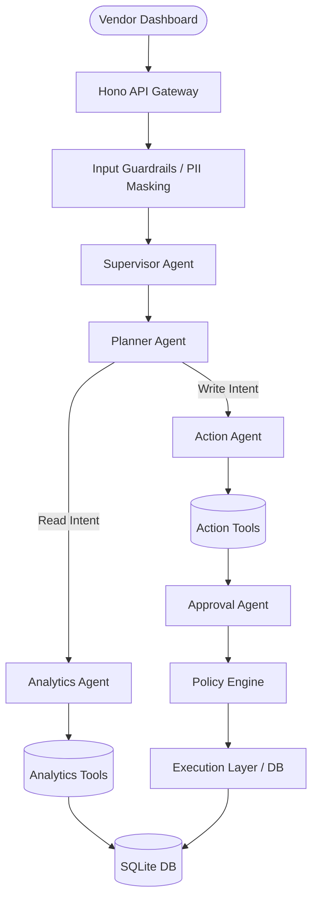
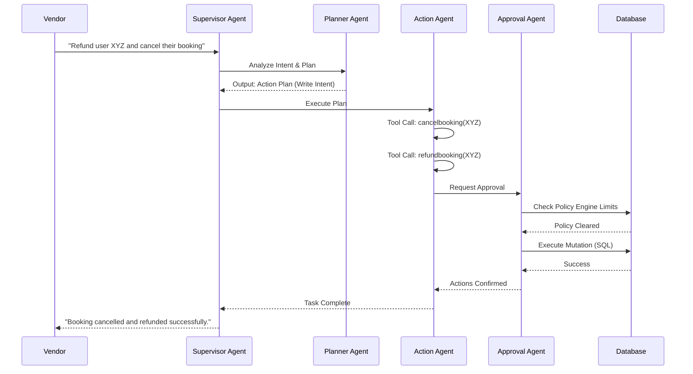

# HobbyFi Copilot - Production-Level Architecture Document

**Author:** Vaibhav Sonava  
**Date:** July 2026  
**Status:** Production (V2)  
**Document Level:** Internal Engineering Document (OpenAI/Microsoft Standards)

## 1. EXECUTIVE SUMMARY

HobbyFi Copilot V2 represents a paradigm shift from a monolithic AI assistant to a **Multi-Agent System (Mastra)**. It serves as the intelligent core for vendor portals, enabling venue owners to completely automate administrative tasks, optimize revenue, and engage with their communities. The upgrade introduces a specialized agentic workflow that decisively routes user intent to Analytics (Read-only) or Action (Write/Execution) agents, orchestrated by a Supervisor and secured via strict Guardrails and Policy Engines.

## 2. MULTI-AGENT SYSTEM ARCHITECTURE

The architecture utilizes the Mastra framework to orchestrate specialized agents for complex, non-deterministic tasks with high reliability.

## 3. TECH STACK

- **Frontend:** Next.js (SaaS Dashboard, Inter Font, No Glassmorphism)
- **Backend API:** Hono (Edge-ready lightweight web framework)
- **Database:** SQLite (LibSQL)
- **ORM:** Drizzle ORM
- **Agent Framework:** Mastra (v1.50.0)
- **LLM Provider:** Ollama AI Provider (Local/Private Inference)
- **Observability:** OpenTelemetry (Node Auto-instrumentations)
- **Queue/Background Tasks:** BullMQ & Redis

## 4. DATABASE DESIGN

The schema encompasses 24 core tables to manage the entire HobbyFi ecosystem.

1. **vendors**: Primary tenant table.
2. **users**: Customer records linked to vendors.
3. **memberships**: Active/Expired user subscriptions.
4. **attendance**: User check-ins at venues.
5. **sports**: Supported sports categories.
6. **venues**: Physical locations owned by vendors.
7. **courts**: Specific playing areas within venues.
8. **coaches**: Staff members linked to specialties.
9. **sessions**: Scheduled coaching or playing slots.
10. **bookings**: User reservations for sessions/courts.
11. **payments**: Transaction ledgers.
12. **trials**: Trial periods for new users.
13. **invoices**: Billing documents.
14. **coupons**: Discount codes.
15. **discounts**: Percentage-based offers.
16. **community_groups**: Interest-based user groups.
17. **community_events**: Group-specific events.
18. **community_posts**: Forum-style posts.
19. **swipe_matches**: Tinder-style player matchmaking logic.
20. **audit_logs**: Immutable system action history.
21. **tool_logs**: Mastra tool execution history.
22. **ai_conversations**: Thread history for the copilot.
23. **approval_requests**: Human-in-the-loop pending actions.
24. **notifications**: System and push messages.

## 5. TOOL CALLING

The system exposes 30+ Mastra tools, heavily segregated into Read (Analytics) and Write (Action) operations.

**Analytics Tools (Read-Only):**
- `getattendance`, `getbookings`, `getcoachperformance`, `getinactiveusers`, `getmembershipanalytics`, `getpaymentsummary`, `getrevenue`, `gettopsports`, `gettrialusers`, `getupcomingrenewals`, `getvenuestats`.

**Action Tools (State-Mutating):**
- `assigncoach`, `blockuser`, `booking`, `cancelbooking`, `createcoupon`, `extendtrial`, `generateinvoice`, `markattendance`, `refundbooking`, `sendreminder`, `updatemembership`.

## 6. MEMORY DESIGN

- **Short-Term Memory:** Conversation threads stored in Redis/Mastra memory modules, maintaining context over a 24-hour window.
- **Long-Term Memory:** Historical interactions persisted in `ai_conversations` SQLite table.
- **Vector Memory (Semantic):** Vendor SOPs, policies, and community guidelines embedded and stored for dynamic retrieval, ensuring the agents adhere to specific vendor rules.

## 7. RAG DESIGN

Retrieval-Augmented Generation (RAG) is implemented to provide context to the agents:
1. **Context Extraction:** When a user queries (e.g., "What is our refund policy?"), the Planner Agent extracts keywords.
2. **Vector Search:** Queries the embedded vector store of vendor documents.
3. **Prompt Injection:** Context is dynamically injected into the Analytics or Action agent's system prompt before tool execution, ensuring compliance with local venue rules.

## 8. ORCHESTRATION WORKFLOWS

## 9. GUARDRAILS

- **Input Guardrails:** Prevent Prompt Injection using heuristics and LLM-based classifiers before it reaches the Supervisor.
- **PII Masking:** Personally Identifiable Information (Emails, Phone Numbers) is obfuscated in transit and only resolved at the DB layer during execution.
- **Output Guardrails:** Ensures AI does not hallucinate financial numbers. All revenue tools return strict JSON mapped directly from SQLite aggregations.
- **Approval Guardrails:** Critical write operations (e.g., mass refunds) require `Approval Agent` review and a physical human-in-the-loop acknowledgement recorded in `approval_requests`.

## 10. OBSERVABILITY

Instrumented with **OpenTelemetry**:
- **Traces:** Every agent transition, tool call, and DB query is traced.
- **Logs:** Pino JSON logs capture agent reasoning steps (`tool_logs` table stores Mastra inputs/outputs and latency).
- **Metrics:** BullMQ queue depths, token usage per agent, and tool execution times.

## 11. SCALABILITY

- **Stateless Agents:** API and Mastra agents run completely stateless on Hono.
- **Database:** LibSQL allows for edge-replication if needed, keeping reads lightning-fast.
- **Queueing:** Heavy tasks (bulk notifications, analytics aggregation) are offloaded to Redis/BullMQ to prevent blocking the Hono event loop.

## 12. FRONTEND ARCHITECTURE

The UI emphasizes high data density and professional utility:
- **Framework:** Next.js (App Router).
- **Typography:** Inter font family for maximum legibility.
- **Design Language:** Brutalist-leaning utility. **No Glassmorphism.** High contrast, crisp borders, solid backgrounds, and dense data tables. Focus is purely on speed and clarity for the vendor.
